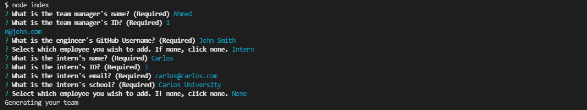

# Team Profile Generator
  

  ## Description
  A command line interface which prompts the user for information a team and various sorts of information such as role, contact information, and id. The information is then passed into a concatenating template literal which generates fully styled team layout for the user.

  ## Built With
  * JavaScript
  * Node.js
  * Bootstrap

  ## Preview
  

  ## Walkthrough video
  Please view the walkthrough of this application at this link: [Video Link](https://drive.google.com/file/d/1lzTBz1atTM5fv9jmNHSNsdRRurtxt6Qw/view)

  ## Table of Contents
  * [Installation](#installation)
  * [Usage](#usage)
  * [License](#license)
  * [Contributing](#contributing)
  * [Questions](#questions)

  ## Installation
  To install the application, follow these instructions:
  Clone the [repository](https://github.com/Ahmed-Sajjad111/team-profile-generator) to your local files, and install [Node.js](https://nodejs.org/en/)

  ## Usage
  Open application with any command prompt interface that you prefer and type in "npm install" After all the packages are installed, simply run "node index.js" and follow the command line interface to generate your very own team layout!

  ## License
  This project is licensed under [MIT](https://opensource.org/licenses/MIT)

  ## Contributing
  [Contributer Covenant Code of Conduct](https://www.contributor-covenant.org/version/2/1/code_of_conduct/)

  ## Questions
  If you have any questions you may reach me at:

  Email: uasajjad11198@outlook.com

  Github: [Ahmed-Sajjad111](https://github.com/Ahmed-Sajjad111/)